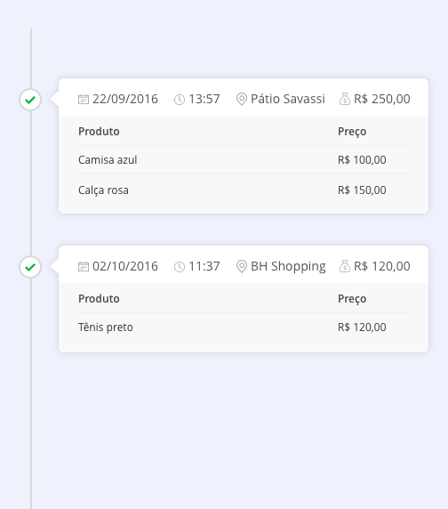

# Desafio Dito

A Dito coleta bilhões de eventos de comportamento on/offline e um dos desafios
diários é gerar valor para os usuários através de informações consistentes e
acessíveis.

Esse desafio é composto por um problema de **Manipulação de Dados**.

O objetivo é criar uma timeline de compras a partir dos eventos disponíveis neste
endpoint: https://storage.googleapis.com/dito-questions/events.json.

Um evento representa um comportamento de uma pessoa, seja no mundo online ou
offline. Quando uma pessoa faz uma compra, um evento **comprou** é gerado
contendo o total de receita gerada e o nome da loja. Para cada produto dessa
compra é gerado um evento **comprou-produto**, contendo o nome e preço do
produto.

A sua tarefa é criar o front end de uma aplicação web para exibir a timeline destes
eventos de compra. Você precisará consumir esse endpoint, agrupando as
compras pelo campo **transaction_id**, e cada item da timeline deve representar
uma compra em uma determinada loja e deve conter uma lista com os produtos
comprados.

A timeline deve ser **ordenada** pelo campo **timestamp** na ordem decrescente.

O frontend deve ser o mais próximo do layout a seguir. Os ícones podem ser
baixados [por aqui](https://storage.googleapis.com/dito-questions/Front-End.zip).

## Critérios de avaliação

* Entrega no prazo;
* Simplicidade da solução;
* Complexidade algorítmica;
* Boas práticas de desenvolvimento de software;
* Semelhança com o layout de exemplo.